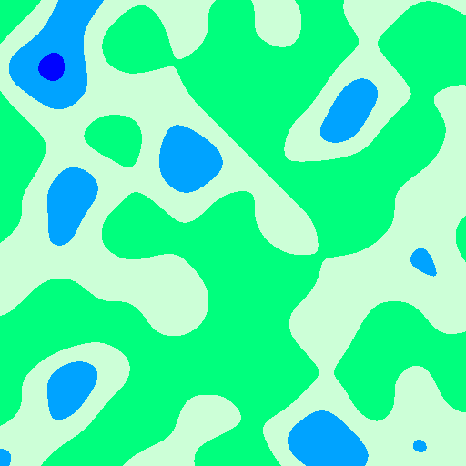

# Noisy
> Simple Perlin noise generation and rendering tool for Aseprite

**Current version is built and tested on Aseprite v1.2.10-beta4 you will need at least Aseprite v1.2.10-beta2 to run scripts**

## FAQ

+ "How do I install this?"
    + Right click and save this link (or you can download the Noise.lua file another way): [Noisy.lua](https://github.com/RenFinkle/noisy/raw/master/Noisy.lua)
    + In Aseprite go to File > Scripts > Open Scripts Folder
    + Copy the Noisy.lua file to your scripts folder
    + (Save anything you are working on and then) Restart Aseprite
    + Go to File > Scripts > Noisy
+ "What if I don't see Scripts?"
    + You are most likely working in a version of Aseprite before Aseprite v1.2.10-beta2, upgrade through the Steam beta channel or elsewhere
+ "X isn't working like it should, doing X popped an error!"
    + Install the latest Aseprite if you haven't already
    + Close and open Aseprite
    + Try filling the canvas with any color and going again
    + Check [issues](https://github.com/RenFinkle/noisy/issues)
    + If there's no existing solution go ahead and submit an issue including steps to replicate the behavior and your Aseprite version!
+ "Why is there only one preset?"
    + At the time of writing filepicker functionality is not publicly available in the Aseprite API, once this is done we will have custom presets files and I will include a file with a bunch of good presets
+ "Why isn't x feature implemented/I have a good idea for a feature where do I put that?"
    + Check [issues](https://github.com/RenFinkle/noisy/issues)
    + If there isn't an existing feature request go ahead and submit one!
+ "What's the license?"
    + Check [LICENSE.md](LICENSE.md)
    + The code uses the GNU GPLv3 license because of the inclusion of the Perlin algorithm
    + Note (Pre emptive): You do not have to mention the use of this plugin in any artwork

## Okay now that we got that out of the way!

#### Welcome to the Noisy tool! This is a tool to do what I've implemented in a number of other languages (but not quite as friendly), noise rendering. There are a lot of different uses for this tool, some common ones include: map generation, cloud generation, starscape generation, and even bumpmap generation

### Let's go over a few things:

## Main dialog
+ Scale
    + Scale is, well, scale, it determines how *zoomed* out you are, the higher the number, the more *zoomed* out
+ Seed
    + Seed is a random seed like in a lot of other generation tools, and like in other generation tools you can either paste in your own seed or generate random seeds until you find one you like!
    + To generate a random seed at generation time check "Random Seed", uncheck it if you no longer want a random seed/if you have found one you like (and if you've found one you like, you may want to copy it to a note somewhere for future use, if you want to keep it in Aseprite, [NxPA Studio](https://thkaspar.itch.io/nxpa) has a Notes tool included)
+ Generate Bumpmap
    + It, well it generates a bumpmap, black and white on the next frame of your animation along with the current rendering, this way you get both!
+ Use color
    + Check this to use color, otherwise it will be black and white
+ Center color
    + This is the color that is set above the bias (think island)
+ Edge color
    + This is the color that is set below the bias (think water)
+ Bias
    + This is the lower bound of the center color. Pushing this higher will create more water, lower will create more land
    + **This can be overriden by color stops at this time**
+ Border Size
    + This is the size of the border between the center and edge color, the border color is automatically calculated from the center and edge color to be right in the middle
+ Presets
    + List of presets, currently only includes Starscape
+ Extra color stops
    + Choose your number of color stops here, then click Add stops to open or reset the color stops dialog
    + Choosing "Choose" and clicking Add stops will destroy the color stops dialog
+ Add stops
    + Read above
+ Ok
    + Runs the generation/rendering algorithm, can take a bit on bigger canvases, 512x512 may take a couple of seconds
+ Cancel
    + Closes the dialog
+ Info
    + Pulls up dialog containing link to repository and version information

### Color stops dialog
+ Color Stop Lower Bound
    + Lower bound of color stops, can be set to 0 to override anything below it
    + Must be lower than upper bound
+ Color Stop Upper Bound
    + Upper bound of color stops, can be set to 100 to override anything above it
    + Setting lower bound to 0 and upper bound to 100 will override center and edge color completely
+ Color Stop X
    + Color of given color stop, the lower the color the close to 0
+ Bias X
    + Bias of given color, the lower the bias the less of the color will be generated